# 📏 Height–Weight Linear Regression Project  
*A Mathematical Exploration of Linear Regression Using Real Data*

---

## 🎯 Project Overview  
This project demonstrates **simple linear regression** by modeling the relationship between a person's height and weight. While many tutorials show *how to run* machine learning code, this project emphasizes **understanding the underlying mathematics**—from the regression equation to performance evaluation.

### Key Questions We Answer:
- 🧮 How does linear regression find the best-fit line?
- ⚖️ Why do we scale features, and how does `StandardScaler` work?
- 📉 What does the R² score *actually* mean?
- 🔍 How can we interpret the model’s predictions in real-world terms?

---

## 📁 Dataset  
We use a cleaned height–weight dataset with:
- **Features:** Height (cm)  
- **Target:** Weight (kg)  
- **Size:** 10,000+ samples (simulated/real-world style)

Example:
```
Height (cm) | Weight (kg)
-----------------------
   165.2    |    62.1
   180.5    |    78.3
   152.0    |    49.8
```

---

## 🛠️ Implementation Pipeline  

```mermaid
graph LR
    A[Raw Data] --> B[Train-Test Split<br/>80/20]
    B --> C[Feature Scaling<br/>StandardScaler]
    C --> D[Model Training<br/>Linear Regression]
    D --> E[Prediction & Evaluation<br/>R² Score]
    E --> F[Real-world Predictions]
```



### 1. **Data Preparation**
   - Split into 80% training, 20% testing
   - Apply `StandardScaler` to height values:
     ```python
     z = (x - μ) / σ  # Centers to mean=0, std=1
     ```
   - Why scaling matters: Ensures gradient descent converges faster (conceptually relevant even with OLS)

### 2. **Model Training**
   - Uses `LinearRegression` from scikit-learn
   - Implements the **Ordinary Least Squares (OLS)** method
   - Finds optimal parameters **m** (slope) and **b** (intercept)

### 3. **Evaluation**
   - Primary metric: **R² (Coefficient of Determination)**
   - Visualizes residuals to check error patterns
   - Compares predictions against test data

### 4. **Prediction**
   - Predict weight for new height values
   - Convert scaled predictions back to original units
   - Provide realistic interpretation with confidence intervals

---

## 📐 The Mathematics Behind the Model  

### 🔹 Regression Equation
The model fits a straight line:

\[
\hat{y} = mx + b
\]

Where:
- \( \hat{y} \) = predicted weight
- \( x \) = height (scaled)
- \( m \) = slope (coefficient)
- \( b \) = intercept

### 🔹 Cost Function: Minimizing SSE
The model finds optimal \( m \) and \( b \) by minimizing the **Sum of Squared Errors (SSE)**:

\[
SSE = \sum_{i=1}^{n} (y_i - \hat{y}_i)^2
\]

Where \( y_i \) = actual weight, \( \hat{y}_i \) = predicted weight.

### 🔹 Model Performance: R² Score
We evaluate using the **Coefficient of Determination**:

\[
R^2 = 1 - \frac{SSE}{SST}
\]

Where **SST (Total Sum of Squares)** is:

\[
SST = \sum_{i=1}^{n} (y_i - \bar{y})^2
\]

**Interpretation:**
- \( R^2 = 0.73 \) → Model explains **73%** of weight variation using height
- \( R^2 = 1 \) → Perfect prediction
- \( R^2 = 0 \) → No better than predicting the mean weight

---

## 📊 Results  

### Performance Metrics:
- **Training R²:** 0.734
- **Testing R²:** 0.728
- **Mean Absolute Error:** ~4.2 kg
- **Root Mean Squared Error:** ~5.4 kg

### Model Parameters (After Descaling):
- **Slope (m):** 0.92 kg/cm → *Each additional cm in height corresponds to ~0.92 kg increase in weight*
- **Intercept (b):** -62.1 kg → *Theoretical weight at 0 cm height (mathematical artifact)*

### Example Predictions:
| Height (cm) | Predicted Weight (kg) | Realistic Range |
|-------------|----------------------|-----------------|
| 160         | 58.1                 | 53.9–62.3       |
| 175         | 73.5                 | 69.3–77.7       |
| 190         | 88.9                 | 84.7–93.1       |

*Range based on ±1 standard error of estimate*

---

## 🚀 How to Run This Project  

### Prerequisites
- Python 3.8+
- Basic understanding of Python and statistics

### Installation Steps
```bash
# 1. Clone the repository
git clone https://github.com/yourusername/height-weight-regression.git
cd height-weight-regression

# 2. Create virtual environment
python -m venv venv

# 3. Activate environment
# On Windows:
venv\Scripts\activate
# On Mac/Linux:
source venv/bin/activate

# 4. Install dependencies
pip install -r requirements.txt
```

### File Structure
```
height-weight-regression/
├── 📁 data/
│   └── height_weight.csv
├── 📁 notebooks/
│   └── height_weight_regression.ipynb
├── 📁 src/
│   ├── train_model.py
│   └── predict.py
├── requirements.txt
├── README.md
└── 📁 outputs/
    ├── regression_plot.png
    └── residuals_plot.png
```

### Quick Start
```python
# Train and evaluate the model
python src/train_model.py

# Make a prediction for a specific height
python src/predict.py --height 170
# Output: For height 170 cm, predicted weight: 68.3 kg
```

---

## 🔍 Insights & Limitations  

### ✅ What the Model Captures Well
1. **Strong linear trend** between height and weight
2. **General predictions** work for population averages
3. **Simple interpretability** — easy to understand relationship

### ⚠️ Limitations to Consider
1. **Individual variation:** Age, gender, muscle mass, and body composition aren't considered
2. **Non-linear extremes:** Very short/tall individuals may not fit the linear pattern
3. **Causation vs. correlation:** Height doesn't *cause* weight; both relate to other factors
4. **Sample bias:** Dataset may not represent all populations equally

### 📈 Possible Extensions
1. **Multiple regression:** Add age, gender, activity level
2. **Polynomial features:** Capture potential non-linear relationships
3. **Regularization:** Lasso/Ridge for feature selection if adding many variables
4. **Different algorithms:** Decision trees or neural networks for complex patterns

---

## 🧠 Learning Outcomes  
By completing this project, you'll understand:

1. **The complete ML pipeline** from data preparation to prediction
2. **Mathematical foundations** of linear regression (OLS, SSE, R²)
3. **Feature scaling** and its importance
4. **Model interpretation** beyond just accuracy scores
5. **Real-world limitations** of simple models

---

## 📚 Resources for Deeper Learning  

### Theoretical Background
- [StatQuest: Linear Regression](https://www.youtube.com/watch?v=nk2CQITm_eo) - Visual explanation
- [Khan Academy: Regression](https://www.khanacademy.org/math/statistics-probability) - Mathematical foundation
- [Scikit-learn Documentation](https://scikit-learn.org/stable/modules/linear_model.html) - Implementation details

### Related Projects
1. **Multiple Linear Regression:** House price prediction
2. **Logistic Regression:** Classification problems
3. **Regularized Regression:** Handling overfitting

---


**⭐ If you found this helpful, consider starring the repository!**  

---
*"Statistics: the only science that enables different experts using the same figures to draw different conclusions." — Evan Esar*
